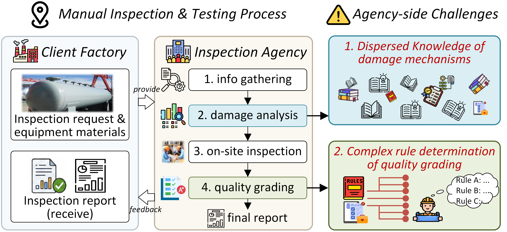

# SEIT-Agent

This repository contains the implementation of **SEIT-Agent**, an experience-memory-enhanced inspection and testing agent for **high-safety special equipment (HSSE)**. The code accompanies the manuscript:

> **SEIT-Agent: An Experience Memory Enhanced Inspection and Testing Agent for High-Safety Special Equipment with Risk-Aware LLM Evaluation**

> [!IMPORTANT]
> **The manuscript is currently under revision. The complete code will be organized and uploaded after the paper is formally published. Citation information will also be updated after publication.**

## Motivation

<p align="center">
  
</p>


High-safety special equipment inspection involves two tightly coupled challenges: retrieving professional damage-mode knowledge from domain documents, and applying context-dependent inspection grading rules without parameter substitution errors. SEIT-Agent is designed to connect these two needs through domain RAG, deterministic grading tools, and experience memory for toolchain planning.

## Overview

Inspection and testing of high-safety special equipment requires both professional knowledge retrieval and strict execution of context-dependent grading rules. SEIT-Agent is designed for two representative tasks in this workflow:

- **Damage mode analysis**: retrieving and organizing technical knowledge about damage mechanisms, morphologies, affected materials, influencing factors, susceptible equipment, prevention measures, and inspection methods.
- **Equipment quality grading**: planning and invoking deterministic grading tools to evaluate inspection results according to non-destructive testing rules.

SEIT-Agent integrates four main components:

- **LLM planner** for task understanding, planning, tool selection, and response generation.
- **Hybrid RAG module** that combines query decomposition, vector retrieval, keyword retrieval, reciprocal-rank fusion, and metadata filtering.
- **Quality grading tool library** that encapsulates inspection grading rules as executable tools.
- **Experience memory module** that stores historical task profiles and toolchains, selectively loads relevant memories, and supports configurable retention strategies.

The project also includes evaluation scripts for grading accuracy and for expert-guided risk-aware LLM evaluation of damage-mode analysis responses.

## Repository Structure

| Path               | Description                                                  |
| ------------------ | ------------------------------------------------------------ |
| `src/`             | Core SEIT-Agent library code, including agent orchestration, LLM provider configuration, RAG retrieval utilities, deterministic grading tools, experience memory logic, and evaluation metrics. |
| `scripts/`         | Executable entry scripts for running damage mode analysis experiments, quality grading experiments, and evaluation workflows. |
| `data/`            | Research datasets and knowledge resources, including damage-mode analysis data, expert key-point data, quality grading data, RAG document chunks, domain knowledge documents, terminology lexicons, and optional prebuilt vector databases. |
| `figures/`         | Paper and README figures, including the motivation figure used near the top of this README. |
| `results/`          | Generated experiment outputs, including grading/RAG result JSON files. |
| `requirements.txt` | Python dependency list.                                      |

The core package is organized as:

```text
src/
├── __init__.py
├── agent.py
├── llm_config.py
├── tools_set.py
├── rag_base.py
└── metric.py
```

where `agent.py` implements the SEIT-Agent workflow and orchestration, `llm_config.py` manages model provider configuration, `tools_set.py` contains deterministic inspection grading tools, `rag_base.py` provides RAG indexing/retrieval/fusion/filtering utilities, and `metric.py` contains evaluation metrics and scoring utilities.

Executable scripts are organized as:

```text
scripts/
├── run_damage_analysis.py
├── run_quality_grading.py
└── evaluate.py
```

where `run_damage_analysis.py` runs damage-mode analysis experiments, `run_quality_grading.py` runs inspection quality grading experiments, and `evaluate.py` evaluates generated experiment outputs.

## Installation

The experiments were developed with Python 3.9. Install dependencies with:

```bash
pip install -r requirements.txt
```

The project uses LangChain, Chroma, DashScope embeddings, BM25 retrieval, Rouge, BERTScore, BLEURT, PyTorch, and related scientific Python packages.

Before running experiments, configure model credentials and providers in `src/llm_config.py`. The public repository will not include real API keys.

## Main Components

### Hybrid RAG

The RAG pipeline supports damage mode analysis. It first decomposes a multi-intent user query into focused sub-queries, then performs vector-based semantic retrieval and BM25 keyword retrieval in parallel. Retrieved candidates are merged using reciprocal-rank fusion and filtered by section metadata before being passed to the LLM.

In the implementation:

- Vector retrieval uses `DashScopeEmbeddings` and Chroma.
- Keyword retrieval uses BM25 with a domain dictionary.
- Metadata filtering uses section headers to retain contextually relevant chunks.

### Quality Grading Tools

The tool library converts non-destructive testing grading rules into deterministic Python functions. These tools are used by the agent to execute rule-based inspection grading instead of relying on free-form natural language reasoning.

Implemented tool groups include:

- Radiographic testing (RT) grading.
- Magnetic particle testing (MT) grading.
- Ultrasonic testing (UT) grading.
- Penetrant testing (PT) grading.
- Supporting grading functions for circular defects, linear defects, and comprehensive quality evaluation.

### Experience Memory

The experience memory module stores historical task profiles and toolchains. During quality grading, the current task is converted into a task profile and compared against the memory pool. Relevant memories are selectively loaded as in-context planning examples.

Supported memory settings include:

- `capacity`: maximum memory pool size.
- `top_k`: number of retrieved memories.
- `alpha`: weight for structured task-profile similarity in hybrid memory retrieval.
- `retention_strategy`: `fifo`, `lru`, or `diversity`.

## Running Experiments

The codebase is organized as a research implementation with executable scripts for the main experiments.

For damage mode analysis, use `scripts/run_damage_analysis.py` and configure the RAG tool behavior through the `lookup()` function:

- `is_hybrid`: enable hybrid vector-keyword retrieval.
- `is_decomposed`: enable query decomposition.
- `is_filter`: enable metadata filtering.

For equipment quality grading, use `scripts/run_quality_grading.py`. Key memory settings are controlled through `memory_config`:

```python
memory_config = {
    "use_memory": True,
    "capacity": 8,
    "top_k": 2,
    "alpha": 1,
    "retention_strategy": "diversity",
}
```

To switch LLM providers, edit `ACTIVE_LLM_PROVIDER` in `src/llm_config.py`. The available provider names are defined in `LLM_CONFIGS`.

## Evaluation

The paper evaluates SEIT-Agent on two tasks.

### Damage Mode Analysis

This task evaluates knowledge retrieval and analytical response quality. The evaluation set contains expert-designed Q&A pairs covering damage mechanisms, damage morphology, affected materials, influencing factors, susceptible equipment, prevention measures, and inspection methods.

The main evaluation metric is an expert-guided risk-aware LLM evaluation strategy, where domain experts define critical and supporting key points, and an external LLM scores generated responses according to key-point coverage and critical-point gating. `metric.py` also provides Rouge-L, BERTScore, and BLEURT evaluation utilities.

### Equipment Quality Grading

This task evaluates the agent's ability to understand inspection data, plan tool invocation, and execute grading rules. The paper uses real inspection records covering RT, MT, UT, and PT quality levels.

The main metrics are:

- **Accuracy**: agreement between predicted quality grade and ground truth.
- **Determinism**: consistency across repeated runs.
- **Inference time**: average processing time per record.

## License

The license will be specified when the repository is prepared for public release.
